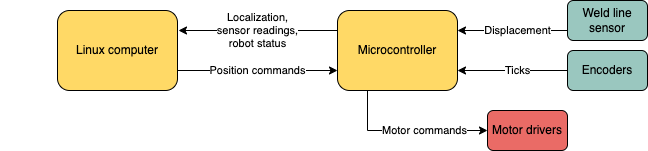
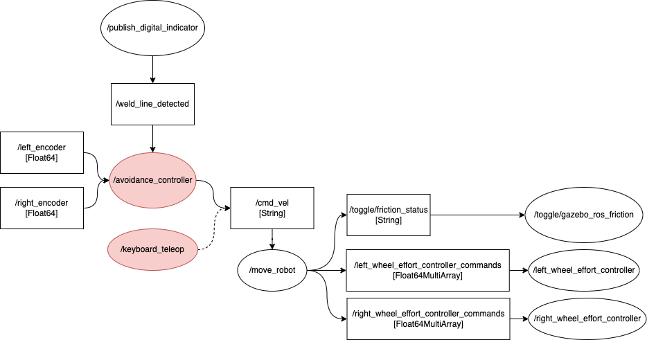

# bluetech simulation


<!-- TODO add the topic/services/actions used -->
# Overview
Contains information about the several ROS2 nodes used to control the bluetech robobt. Run any of these nodes to control the robot after using the ```bluetech_sim.launch.py``` file. 
```
ros2 launch bluetech_simulation bluetech_sim.launch.py
```

To control the robot’s movements, a ROS2 framework was implemented. An Nvidia
Jetson nano or an external linux computer runs the ROS2 framework and a Raspberry
Pi Pico microcontroller controls the motors through embedded C code. The linux machine takes the
behavioral and planning decisions, and sends motor commands over a ROS2 topic that
the microcontroller subscribes to. The C code on the microcontroller interprets the
message received over the topic and executes the corresponding motor actions.



The sensor values like the displacement from the weld line sensor, the ticks from
the encoder, etc are published from the Pico to ROS2 topics that the Linux computer
processes. The motor commands are then communicated through a ROS2 topic to the
micro controller, in this case the Raspberry PI Pico.
# Nodes

### avoidance_controller

```
ros2 run bluetech_simulation avoidance_controller
```
Allows the robot to move autonomously and stay within a weld-line delimited rectangle
|                           Step 1                           |                           Step 2                           |                           Step 3                           |
| :--------------------------------------------------------: | :--------------------------------------------------------: | :--------------------------------------------------------: |
|  |  |  |

Below is a diagram explaining the relations between the avoidance controller and the robot control: 


### keyboard_teleop

```
ros2 run bluetech_simulation keyboard_teleop
```
Allows the robot to be controlled through keyboard inputs. The inputs and executed commands are the following: 
| user input |     executed command     |
| ---------- | :----------------------: |
| a          |  Maximize left friction  |
| s          |  Minimize left friction  |
| d          | Maximize right friction  |
| f          | Minimize right friction  |
| r          | Rotate around right foot |
| l          | Rotate around left foot  |

### bluetech_localization

```
ros2 run bluetech_simulation bluetech_localization
```
Updates the position of the robot based on the current encoder readings. 

This handles the robot movemet correctly by moving only one motor at 
a time.

| publisher       |              topics              |      subscriber       |
| --------------- | :------------------------------: | :-------------------: |
| publish_encoder | /right_encoder and /left_encoder | bluetech_localization |

Sequence of events:

1. Update time information (current time, time elapsed)
2. Update the robot theta - total angle moved by both the motors 
   theta = right_radians - left_radians (-ve sign to handle orientation)
3. To get the current position of the chassis_link. Check which motor is rotating
   1. get the current position of the rotating motor wrt the odom frame
   2. rotate the chassis_link about the origin (origin: rotating frame) by the angle moved by the motor
   3. shift the origin of the chassis_link to the position of the current rotating motor

4. Update the current velocities
5. Publish tf2 and odom data

### forward_effort

```
ros2 run bluetech_simulation feed_forward 0.5
```
Applies a torque to the left and right wheel joints and toggles friction to move the robot forward. 
